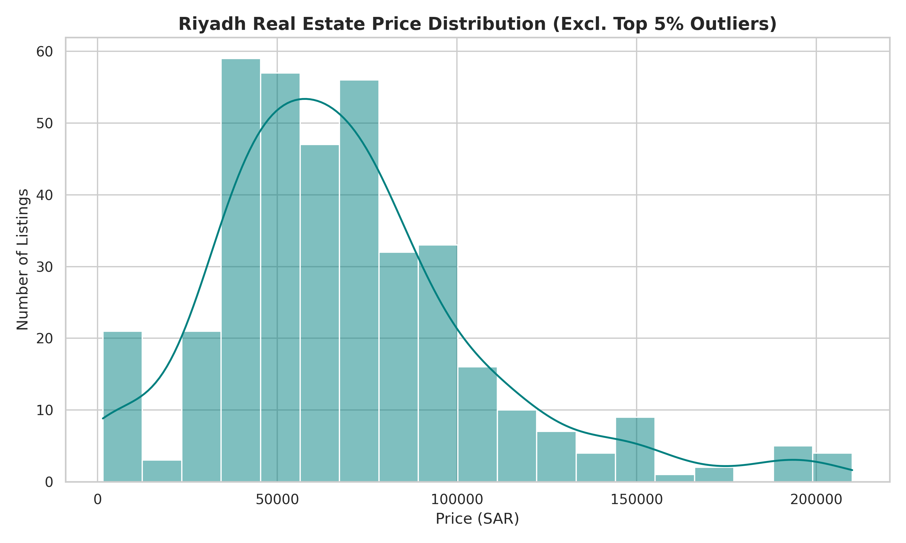
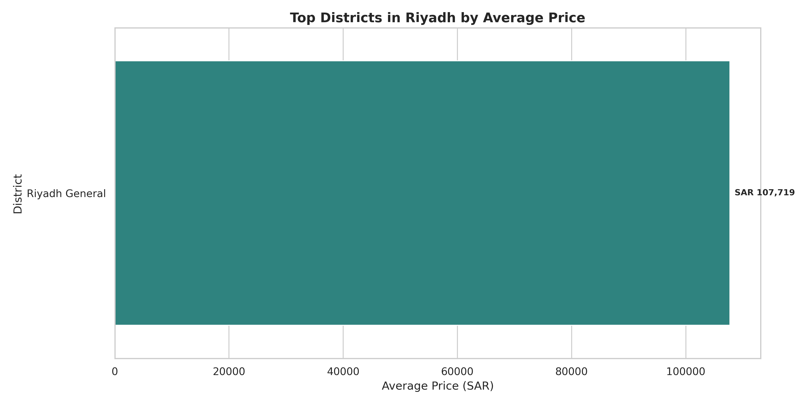

# Riyadh Real Estate Market Analyzer 🏙️🇸🇦

An automated Python-based web scraper and data analysis pipeline that extracts real estate property listings across Riyadh, cleans numerical metrics, handles multi-format properties (general vs. apartments), and calculates key pricing indicators like average price per square meter ($\text{SAR/m}^2$) grouped by neighborhood district.

## 🚀 Key Features
- **Polite scraping**: Uses the configured ScraperAPI account, spaces page requests, and stops on access-denied or challenge responses rather than attempting to bypass them.
- **Attribute Extraction**: Parses property prices (SAR), surface area ($\text{m}^2$), listing titles, and district locations.
- **Data Cleaning & Analysis**: Cleans raw text attributes, filters invalid records, and computes average and median $\text{SAR/m}^2$ grouped by Riyadh district using Pandas.
- **Targeted Categorization**: Includes dedicated analysis pipelines for general residential properties as well as strict apartment-only filtering.

## 📁 Repository Deliverables
- `scrape_riyadh_full.py`: Production scraper script utilizing Playwright browser automation.
- `clean_and_analyze.py`: General data cleaning pipeline calculating overall neighborhood price metrics.
- `clean_and_analyze_apartments.py`: Apartment-specific data cleaning and filtering pipeline.
- `riyadh_district_price_analysis.csv`: Processed master dataset grouped by district.
- `riyadh_district_apartment_analysis.csv`: Processed apartment-specific dataset grouped by district.
- `riyadh_raw_listings.csv`: Raw extracted listing dataset.
- `requirements.txt`: Python package dependency list.

## 🛠️ Tech Stack
- **Python 3**
- **Playwright** & `playwright-stealth`
- **Pandas** & **NumPy**
- **Matplotlib** & **Seaborn** (for visualization)

## 📊 Sample Portfolio Visualizations

### Riyadh Real Estate Price Distribution


### Top Districts by Average Property Price


## ⚙️ Quick Start / Setup

For local runs, open PowerShell in this project directory and run `python .\scrape_riyadh_full.py --max-pages 1` for a one-page test. The script securely prompts for `SCRAPER_API_KEY` if it is not already set in that terminal; alternatively, set `$env:SCRAPER_API_KEY = "your-key"` first. For GitHub Actions, configure a repository Actions secret named `SCRAPER_API_KEY`; the workflow supplies it to the script non-interactively. The scraper backs off on rate limits and stops when access is denied. If an API key was previously committed or shared, revoke it and create a replacement.

1. **Clone the repository:**
   ```bash
   git clone [https://github.com/redakh777/riyadh-real-estate-analyzer.git](https://github.com/redakh777/riyadh-real-estate-analyzer.git)
   cd riyadh-real-estate-analyzer
